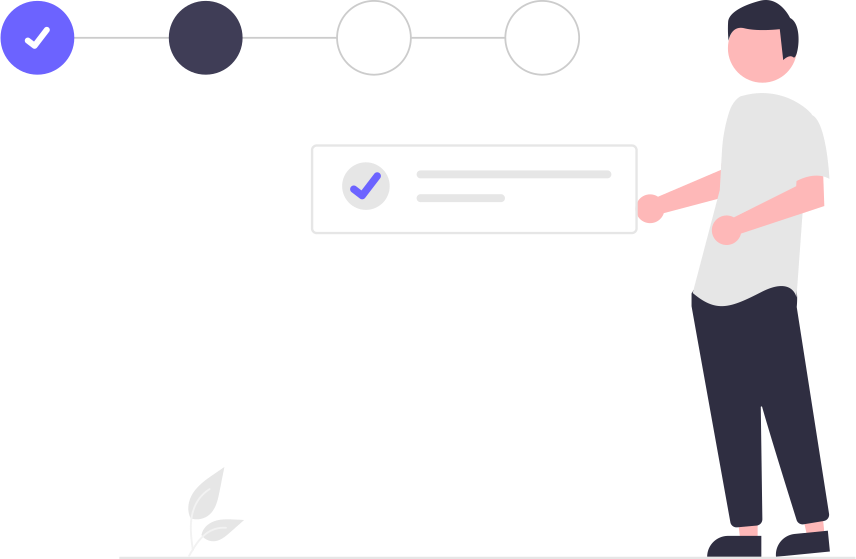

# Formulário de Cadastro 🔧

Este projeto é um formulário simples de cadastro criado com **HTML5** e estilizado com **CSS3**. Ele inclui campos de entrada para informações básicas, como nome, sobrenome, e-mail, celular e senha, além de opções de seleção para gênero. Este README descreve os principais aspectos do projeto e como utilizá-lo.

---

## Estrutura do Projeto 🌐

O formulário está organizado em uma estrutura de diretórios da seguinte forma:

```
/
|-- index.html       # Arquivo principal do formulário
|-- assets/
    |-- css/
        |-- style.css    # Arquivo de estilos CSS
    |-- img/
        |-- undraw_fill_form_re_cwyf.svg   # Imagem ilustrativa do formulário
```

---

## Funcionalidades 🔄

1. **Campos de Cadastro:**
   - 👤 Primeiro Nome
   - 👥 Sobrenome
   - 📧 E-mail
   - 📱 Celular
   - 🔑 Senha
   - 🔒 Confirmação de Senha

2. **Seleção de Gênero:**
   - ♀️ Feminino
   - ♂️ Masculino
   - 🤷‍♂️ Outros
   - 🙈 Prefiro não dizer

3. **Botões de Ação:**
   - 🔐 Botão para **Entrar** (login).
   - ➡️ Botão para **Continuar** com o cadastro.

4. **Imagem Ilustrativa:**
   - Uma imagem SVG (“undraw_fill_form_re_cwyf.svg”) é usada como decoração ao lado do formulário.

---

## Requisitos 🔗

- 🔄 Navegador moderno com suporte a HTML5 e CSS3.
- 📝 Estrutura de arquivos conforme descrita acima.

---

## Como Usar 🕹️

1. **Clone ou baixe este repositório.**
   ```bash
   git clone https://github.com/aarleyzin/Formulario.git
   ```

2. **Abra o arquivo `index.html` em um navegador.**
   - Você pode clicar duas vezes no arquivo ou servi-lo em um servidor local.

3. **Preencha os campos do formulário** com as informações solicitadas.

4. **Estilo:**
   Certifique-se de que o arquivo CSS está devidamente referenciado no cabeçalho do HTML:
   ```html
   <link rel="stylesheet" href="assets/css/style.css">
   ```

5. **Imagem:**
   Confirme que a imagem ilustrativa está no caminho correto:
   ```html
   
   ```

---

## Possíveis Problemas e Soluções ⚠️

1. **Imagem não aparece:**
   - Verifique se o caminho para a imagem SVG está correto.
   - Confirme que o arquivo foi incluído no projeto.

2. **Estilos CSS não são aplicados:**
   - Confirme que o arquivo `style.css` está no diretório correto.
   - Verifique a tag `<link>` no HTML para garantir que o caminho para o CSS está correto.

3. **Botões sem funcionalidade:**
   - Este formulário é apenas visual. Para adicionar funcionalidade, é necessário implementar o back-end com uma linguagem como **JavaScript**, **PHP** ou outros.

---

## Como Contribuir 📚

1. Fork este repositório.
2. Crie um branch para sua funcionalidade.
   ```bash
   git checkout -b minha-funcionalidade
   ```
3. Faça suas alterações e commit.
   ```bash
   git commit -m "Adicionando nova funcionalidade"
   ```
4. Envie suas alterações.
   ```bash
   git push origin minha-funcionalidade
   ```
5. Abra um Pull Request.

---

## Licença 📄

Este projeto está licenciado sob a [MIT License](LICENSE).

